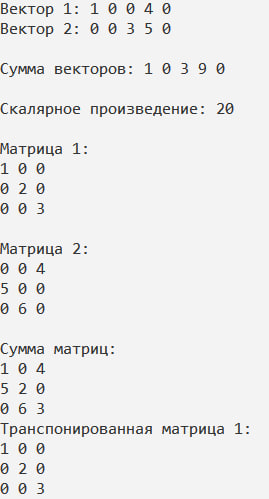

МИНИСТЕРСТВО НАУКИ И ВЫСШЕГО ОБРАЗОВАНИЯ РОССИСКОЙ ФЕДЕРАЦИИ

Федеральное государственное автономное образовательное учреждение высшего образования «Национальный исследовательский университет ИТМО» (НИУ ИТМО)

Факультет программной инженерии и компьютерной техники 


# Отчет по Лабораторной №4 по дисциплине "Программирование на С++"

***Тема: Работа с разреженными векторами и матрицами***

***Работу выполнила: Люкина Д. С.***

***Группа: P4119***

***Преподаватель: Лаздин А.В.***

--------

***Задача***

В том случае, когда подавляюще большое количество элементов вектора или матрицы равны нулям для их хранения имеет смысл использовать структуры данных, позволяющие существенно экономить память, за счёт того, что нули можно не хранить.

Задание: разработать шаблонные классы для хранения разреженных вектора и 2D матрицы для чего:

Предложить структуры данных для хранения значений исходных векторов и матриц. (подсказка: использование хеш-таблиц — хорошая идея), рассмотрите необходимость поддержки собственных итераторов;

Реализовать набор унарных и бинарных операций для вектора и матриц; (транспонирование, сложение, произведение векторов (вспоминаем линейную алгебру), обращение матрицы, возведение матрицы в степень — предусмотреть два варианта с целочисленным и вещественным показателем, подумать на тему относительно того, как решить вопрос с возведением в степень — т.  е. в степень можно возводить только квадратные матрицы, но не создавать же отдельный класс для квадратных и для прямоугольных матриц, или создавать?), произведение вектора и матрицы.

Реализовать поэлементные операции для элементов векторов и матриц — арифметические операции со скалярной величиной, поэлементное возведение в степень.

Провести сравнение скоростей обработки предложенного вами способа хранения и обработки разреженных матриц и выполнение тех же действий над векторами и матрицами, хранящимся с помощью стандартного контейнера vector.

***Решение***

- *Класс SparseVector<T>*

Реализует разреженный вектор, использующий хеш-таблицу для хранения ненулевых значений.

**Методы:**

1) T scalarProduct(const SparseVector& another_items) const 

Вычисляет скалярное произведение текущего вектора с другим разреженным вектором.

```
T scalarProduct(const SparseVector& another_items) const {
    if (size_items != another_items.size_items) 
        throw invalid_argument("Разные размеры векторов");
    T result = T();
    for (const auto& [index, value] : items) {
        result += value * another_items[index];
    }
    return result;
}
```

2) void print(const string& str = "") const;

Выводит содержимое вектора на экран. Может содержать дополнительное сообщение.

**Операторы:**

1) Оператор []:

```
T& operator[](size_t index) {
    if (index >= size_items)
        throw out_of_range("Выход за допустимый диапазон");

    return items[index];
}

const T operator[](size_t index) const {
    if (index >= size_items)
        throw out_of_range("Выход за допустимый диапазон");

    if (items.find(index) != items.end()) {
        return items.at(index);
    }
    return T();
}
```

Позволяет доступ к элементам вектора по индексу. Если элемент не установлен, возвращает ноль.

2) Оператор +:

```
SparseVector operator+(const SparseVector& another_items) const {
    if (size_items != another_items.size_items)
        throw invalid_argument("Разные размеры векторов");
    SparseVector result(size_items);
    for (const auto& [index, value] : items) {
        result[index] = value + another_items[index];
    }
    for (const auto& [index, value] : another_items.items) {
        if (items.find(index) == items.end()) {
            result[index] = value;
        }
    }
    return result;
}
```

Реализует сложение двух разреженных векторов. Создает новый вектор, состоящий из суммы соответствующих элементов.


- *Класс SparseMatrix<T>*

Класс SparseMatrix реализует разреженную матрицу, также использующую хеш-таблицы для хранения ненулевых значений.

**Методы**

1) SparseMatrix transpose() const; 

Возвращает транспонированную версию данной матрицы.

```
SparseMatrix transpose() const {
    SparseMatrix result(cols, rows);
    for (const auto& [row, row_map] : items) {
        for (const auto& [col, value] : row_map) {
            result(col, row) = value;
        }
    }
    return result;
}
```

2) void print(const string& str = "") const;

Выводит содержимое матрицы на экран с указанным заголовком.

Результат:

